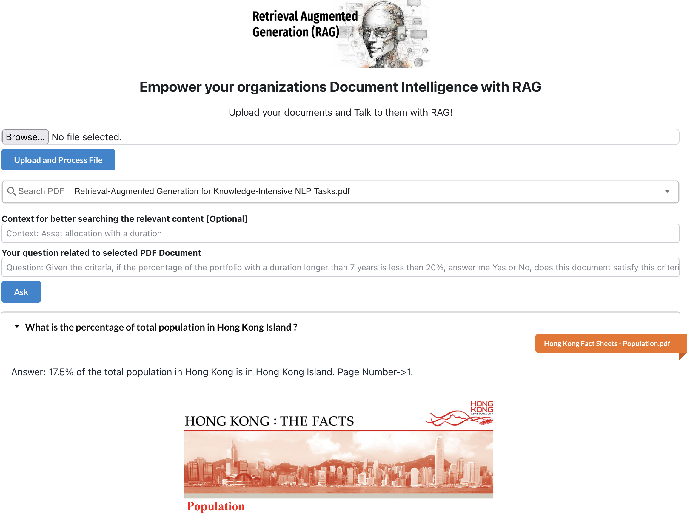
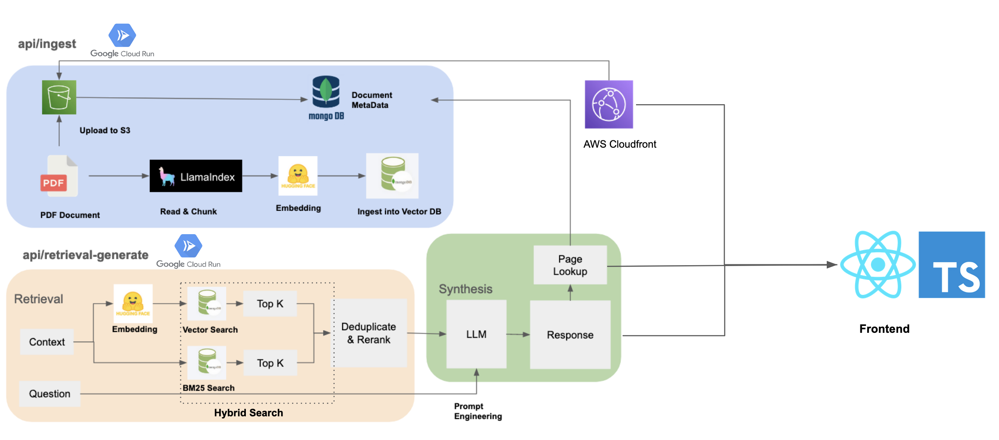

# Full Stack Implementation to Build an RAG (Retrieval Augmented Generation) Application

## Brief Introduction
A Next.js Retrieval-Augmented Generation (RAG) Application that allow users to upload PDF document and ask questions related to the selected document. 
It achieves this by retrieving pertinent data or documents related to a specific question or task and utilizing them as contextual information for the LLM.

## Preview



##   Architecture



## Tech Stack
- Framework: Next.js with React
- Database: MongoDB
- ORM: Prisma
- UI: Material UI, Semantic UI, Radix UI

## Run Locally
```shell
npm install
npm run dev
```

## Backend
Github: https://github.com/Nelsonlin0321/webdev-rag-backend-api